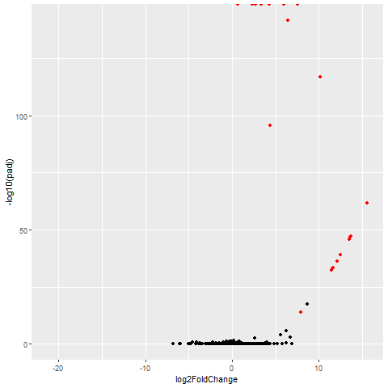

## About Flux-Simulator

Flux simulator is a program that can simulate a variety of parameters in the sequencing process to generate fasta files that can be used for analysis. For example, it can simulate error in the sequencing process, GC bias or PCR amplification bias, among other manipulable factors. It doesn't have a built in method for specifiying differential expression. We downloaded the flux simulator program using conda but it can also downloaded from their website and compiled locally.

# Initial Set-up

## Required Files

First, Flux simulator requires both a gtf file and individual and a full set of fasta files for each chromomsomes. The chromosomes were downloaded from (ftp://hgdownload.cse.ucsc.edu/goldenPath/hg38/chromosomes/) and the gtf file used was the gencode.v32.annotation.gtf, which was downloaded from the gencode website. 

### myParameters.par file

The chromosome folder and gtf file are referenced in a text file which needs to be called myParameters.par. The names for the options are separated by a space. Below is the text used in the myParameters.par file used in this simulation:

```{bash parameter file, include=TRUE, eval=FALSE}
REF_FILE_NAME   /home/AD/jbrenton/flux_tests/gencode.v32.annotation.gtf
GEN_DIR         /home/AD/jbrenton/flux_tests/chromosomes

NB_MOLECULES    30000000
READ_NUMBER     30000000

# use default 76-bp error model
##ERR_FILE        76

# create a fasta/fastq file
FASTA           YES
SEED 6

##changetmp file as normal fails
TMP_DIR /home/AD/jbrenton/flux_tests/flux_10.12.19
```

In this file we create a Fasta output file and if an error file parameter is included (not in this case) a fastq file is output instead. The number of molecules and read number was set at 30 million, otherwise the options were kept simple for this simulation. 

### Command line code entry 

For command line entry the following code were used to create 10 output samples in separate folders using the slurm scheduler:

```{bash command line entry, include=TRUE, eval=FALSE}
mkdir flux_10.12.19
cd flux_10.12.19
for i in {1..10}; 
do 
mkdir -p sample_${i}; 
cp /home/AD/jbrenton/flux_tests/myParameters.par sample_${i}; 
cd sample_${i}; 
sbatch /home/AD/jbrenton/flux_tests/flux_script.job; 
cd ..; 
done
```

This creates individual folders that have a myParameters.fasta file containing the reads. 

Note:

The flux_script.job file is a script file containing:

#!/bin/bash

flux-simulator -p myParameters.par

---

# Creating differential expression

Now to create a set of upregulated genes, we randomly picked 20 genes related to immunoglobulin function (a random choice). The names of these 20 genes were added to a text file called gene_list.txt with each gene on its own row. The following code was used to find their location in the gencode gtf file and extract the full headers and place them into a new file.

```{bash gene list gtf, include=TRUE, eval=FALSE}
for name in `cat gene_list.txt`
do
grep $name gencode.v32.annotation.gtf >> upreg_genes.gtf
done
```

From here we can see that there are 98 unique transcripts:

```{bash unique transcripts, include=TRUE, eval=FALSE}
cat upreg_genes.gtf | grep "ENST" | awk '{print $12}' | uniq | wc
```

Which returns 98 seprate lines, so there are 98 unique transcripts. And in the main gencode file there are 227425 lines, i.e 227425 transcripts. So to generate ~ four fold increase in these transcripts the upreg_genes.gtf file was used to generate reads with the same myParameters.par file, however, the number of reads and molecules was changed to 51709. As: ((98/227425)*30000000)*4=51709.36. This is the number of percentage of transcripts in the gene list file to the main gencode file multiplied by the number of molecules/reads used with the main gencode file, multiplied by four for a roughly four fold increase across transcripts.

*However, what I should have done is probably grepped for protein coding genes in both the gencode gtf and the upreg_genes gtf as there are plenty of multiple transcripts in the gtf files which have the same transcript id and the numbers of these for each gene may not be comparable between the two files. I.e the genes in the gene_list file may not have a similar number of non-coding transcripts compared to the average in the gencode file. These transcripts may be used by flux-simulator to generate reads. This problem was created by using uniq instead of the total number of lines in each file, or just making sure each gencode had a unique transcript id for each transcript. Also a better idea of the mathematical functions behind the creation of reads by flux simulator might help a bit more to generate more exact fold change*

*Also should have separately run the flux simulator on the upregulated genes for each sample and this might have evened out the increase in upregulation (see below)*

Anyway, so then the following code was used on the upregulated gene gtf to generate a fasta file.

```{bash flux code for upreg, include=TRUE, eval=FALSE}
mkdir -p up_reg_fasta_folder
cp myParameters_upreg.par up_reg_fasta_folder
cd up_reg_fasta_folder
flux-simulator -p myParameters_upreg.par
```

With the myParameters_upreg.par file looking like:

```{bash myParameters_upreg.par, include=TRUE, eval=FALSE}
REF_FILE_NAME   /home/AD/jbrenton/flux_tests/upreg_genes.gtf
GEN_DIR         /home/AD/jbrenton/flux_tests/chromosomes

NB_MOLECULES 51710
READ_NUMBER 51710

# use default 76-bp error model
##ERR_FILE        76

# create a fasta/fastq file
FASTA           YES
SEED 6

##changetmp file as normal fails
TMP_DIR /home/AD/jbrenton/flux_tests/up_reg_fasta_folder
```

## Concatenating upregulated genes to the fasta files

This upregulated fasta file was then concatenated to 5 of the samples from before to create a group with these upregulated genes. 

```{bash concatenating, include=TRUE, eval=FALSE}
###renamed myParameters_upreg.fasta to up_reg_10.12.19.fasta
###moved this to flux_10.12.19 folder
then
for i in {1..5}; 
do 
cat up_reg_10.12.19.fasta sample_${i}/myParameters.fasta > sample_${i}/sample_${i}.fasta; 
gzip sample_${i}/sample_${i}.fasta; 
done
```

Also the other fasta files were compressed too and their names were changed:

```{bash zipping, include=TRUE, eval=FALSE}
for i in {6..10}; 
do 
cp sample_${i}/myParameters.fasta sample_${i}/sample_${i}.fasta; 
gzip sample_${i}/sample_${i}.fasta; 
done
```

Then the shuffling, quantifying with salmon, analysis with DESeq was performed with the same code as with the polyester reads.

## Final Results



The output generate significant reads for the desired transcripts but the fold change is not exactly uniform or 4-fold.

