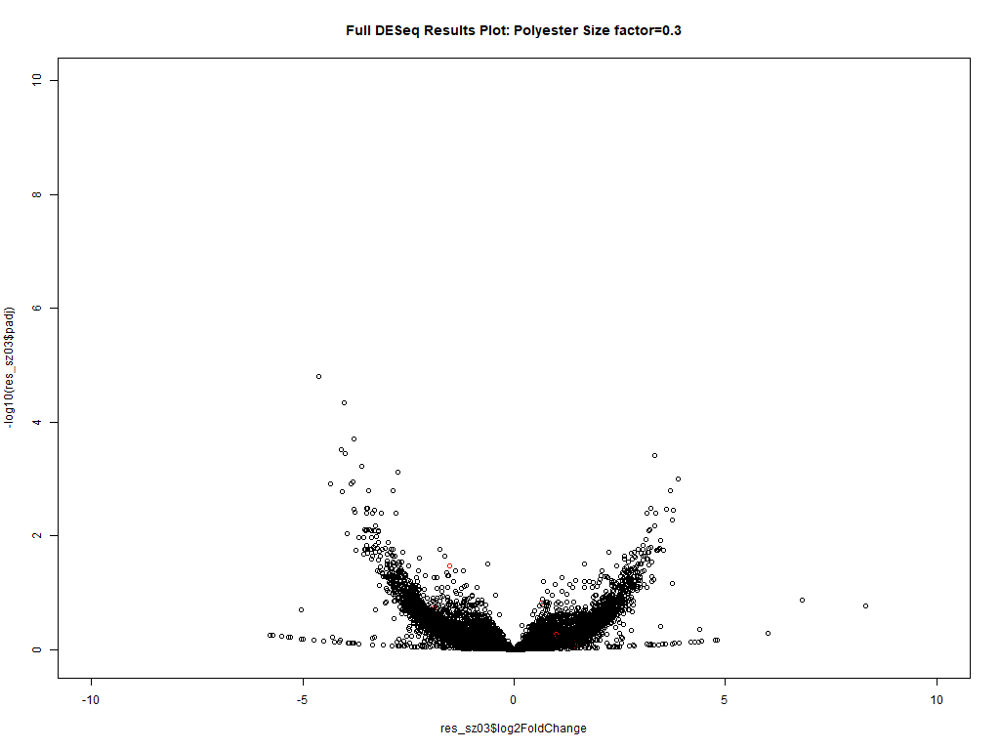
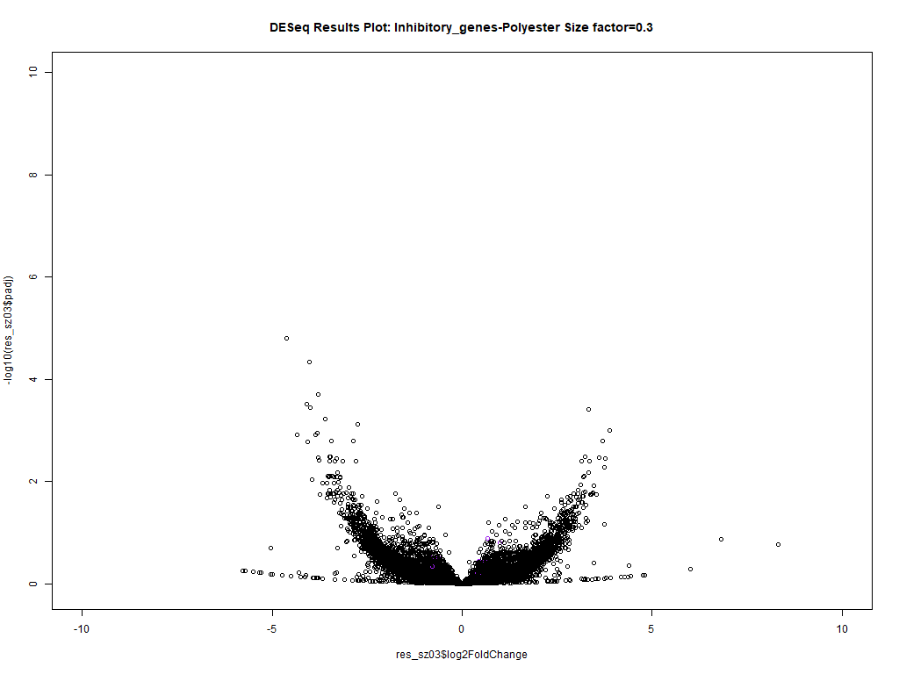
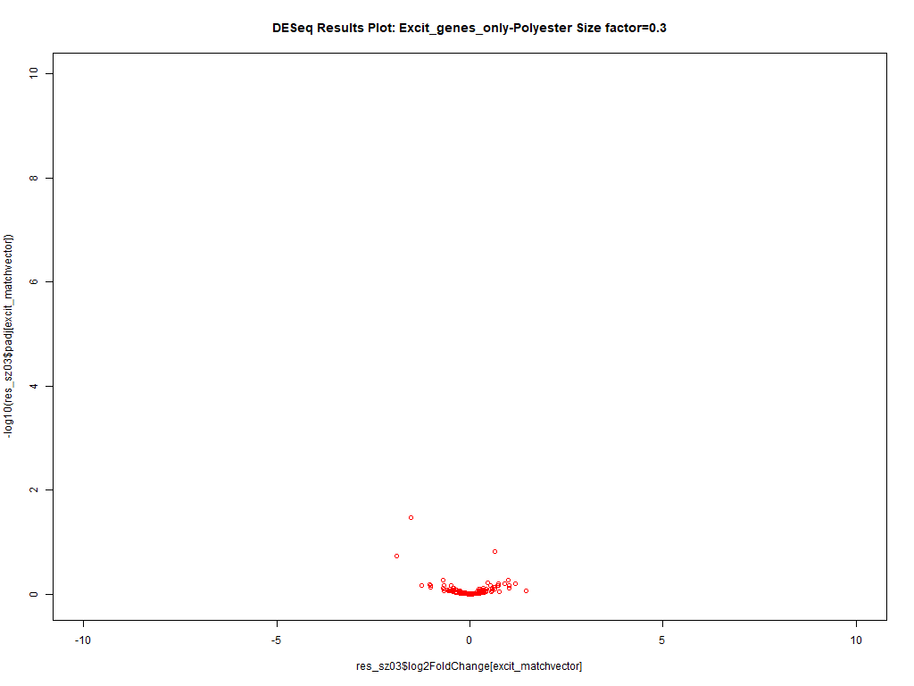
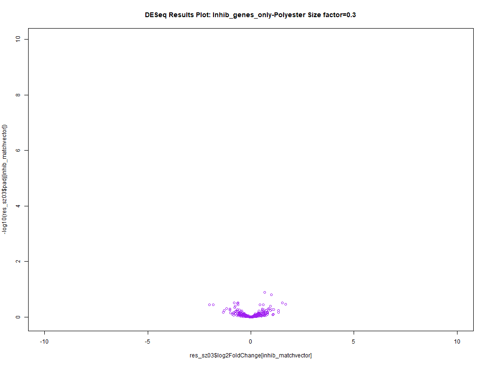
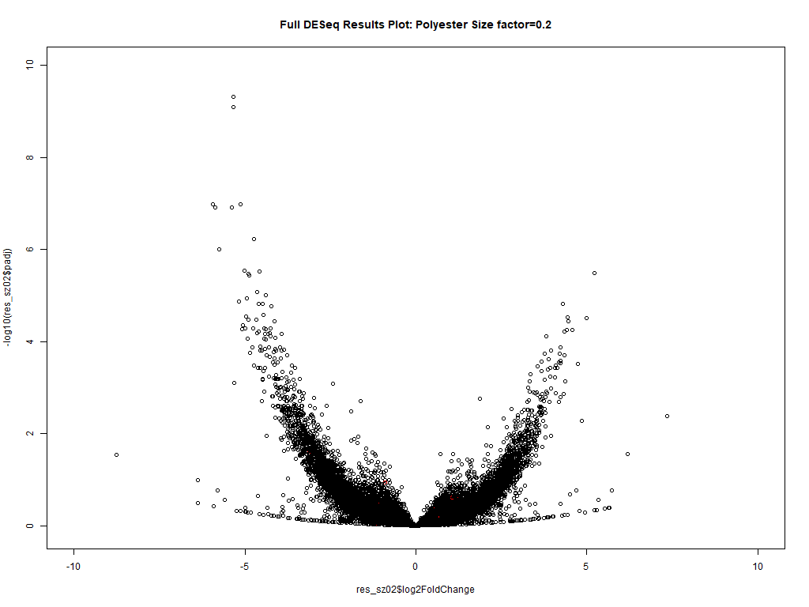

# Loading the Salmon Samples

```{r samples, include=TRUE, eval=FALSE}
library(EnsDb.Hsapiens.v86)
library(Biostrings)
library(stringr)
library(dplyr)
library(tximport)
library(plyr)
library(png)

setwd("C:/Users/JBrenton/Polyester_analysis_30_09_19/salmon_quants_15_10_19_s03/alignments")
dir<-getwd()

c(seq(01,40))->x
samples<-c(1:length(x))
header<-c(1:length(x))
for (i in x) {
  headername<-paste0("sample_", i, "_salmon_quant")
  header[i]<-headername
  if (file.exists(file.path(dir, headername, "quant.sf"))==TRUE) {
    samples[i] <- file.path(dir, headername, "quant.sf")
  }
  
}

names(samples) <- paste0(header)

c(seq(1,9))->y
samples2<-c(1:length(y))
header2<-c(1:length(y))
for (i in 1:length(y)) {
  headername<-paste0("sample_0", i, "_salmon_quant")
  header2[i]<-headername
  if (file.exists(file.path(dir, headername, "quant.sf"))) {
    samples2[i] <- file.path(dir, headername, "quant.sf")
  }
}
names(samples2) <- paste0(header2)

samples[1:9]<-samples2[1:9]
names(samples[1:9])<-names(samples2[1:9])

y<-c(21,27,02,28,34)
samples<-setdiff(samples,samples[y])
names(samples)<-setdiff(header,header[y])

all(file.exists(samples))
```

This section of the code specifies the working directory to retrieve the quant.sf files from the salmon output, to be used with tximport. The quant.sf filenames are specified in a full path and to verify they exist. The last sections of the code are used to rename the files with a 0 for the first 0-9 files as they are called sample_01 instead of sample_1; and the other section is to remove files that failed in the polyester simulation, due to memory allocation on the server.

---

## Tximporting

```{r tximport, include=TRUE, eval=FALSE}
print("############### got all folders, now importing")
gencode_txid_to_geneid<-read.delim(file ="C:/Users/JBrenton/Polyester_analysis_30_09_19/deseq_work_06.10.19/genecode_txid_to_geneid.txt", sep=" ", header=FALSE)
colnames(gencode_txid_to_geneid)<-c("tx_id", "gene_id","gene_name")
gencode_txid_to_geneid$tx_id<-sub("\\..+", "", gencode_txid_to_geneid$tx_id)
gencode_txid_to_geneid$gene_id<-sub("\\..+", "", gencode_txid_to_geneid$gene_id)

txi.salmon_sz03 <- tximport(samples, type = "salmon", 
tx2gene = gencode_txid_to_geneid, ignoreTxVersion=TRUE)
```

Here we import a reference file, created in the polyester code section, to use as a reference between transcript ids, gene ids and gene names (we found there was less mismatches and generation of NAs than using the bitr function in downstream analysis). We also change the column names but do not need to remove the version information on both trancsript and gene ids as this was done earlier in the polyester code. Then the tximport function is used to create a txi object. The samples are used to specify the location, type is set to salmon. the reference object is specified for transcript to gene id mapping and the ignore version setting is specified to avoid mismatches.

---

# DESeq

### Setup of Deseq dataset and groups

```{r DESeq setup, echo=TRUE, eval=FALSE}
condition<-c(1:length(samples))
for (i in 1:length(samples)){
  if(i<20){
    condition[i]<-"A"
  } else{
    condition[i]<-"B"
  }
}

library(DESeq2)
sampleMetadata <- data.frame(
  samples = names(samples),
  condition = condition
)
dds_sz03 <- DESeqDataSetFromTximport(txi.salmon_sz03,
                                colData = sampleMetadata,
                                design = ~ condition)
keep <- rowSums(counts(dds_sz03)) >= 10
dds_sz03 <- dds_sz03[keep,]
```

A data frame to encode the group identity of each sample is set up using a for loop. This information is then imported into a DESeq object, along with the tximport object containing the count values, using the *DESeqDataSetFromTximport* function, the design parameter is how groups should be allocated. We then remove genes with low counts to speed up the DESeq testing and transformation, although it is also performed later by the results function.

---

### Creating results file

```{r DESeq, echo=TRUE, eval=FALSE}
dds_sz03 <- DESeq(dds_sz03)
res_sz03 <- results(dds_sz03)
res_sz03$gene <- row.names(res_sz03)
resOrdered_sz03 <- res_sz03[order(res_sz03$pvalue),]
resOrdered_sz03$gene <- row.names(resOrdered_sz03)
resOrdered_sz03 <- as.data.frame(resOrdered_sz03)
```

The DESeq function is used to make a DESeq object and then the results function is used to perform differential expression testing. The results of the function are the ordered by p-value.

### Making Graphs

```{r setting up gene plotting, echo=TRUE, eval=FALSE}
setwd("C:/Users/JBrenton/Polyester_analysis_30_09_19")
read.table("Excitatory_genes_transcripts_upregulated.csv", header = TRUE, sep=" ")->Excitatory_genes
names(Excitatory_genes)[1]<-"tx_id"
res_sz03$colour="black"
left_join(gencode_txid_to_geneid, Excitatory_genes, by="tx_id")->excit_merged
na.omit(excit_merged)->excit_merged_no_na
unique(excit_merged_no_na$gene_id)->excit_gene_names
excit_matchvector<-na.omit(match(excit_gene_names,res_sz03$gene))
res_sz03$colour[excit_matchvector]="red"
png(filename = "Full_DESeq Results Plot-Polyester Size factor=0.3_Excitatory_Genes.png", width = 1024, height = 768)
plot(res_sz03$log2FoldChange, -log10(res_sz03$padj), col=res_sz03$colour, ylim=c(-0.1,10), xlim=c(-10,10), main= "Full DESeq Results Plot: Polyester Size factor=0.3")
##There are a few outliers with a log2 fold change of > 20, that were cut by limits of graphs-but these did not match any genes that should be upregulated.
dev.off()
```



The genes that were upregulated in the fold change matrix are read and converted to a data frame, and the dataframe is joined to the gencode reference file, so that gene ids are added to this file. This is then matched to locations in the DESeq results file. These results are used to highlight in red the locations of upregulated genes in the first group in a graph which is added to a png file.

```{r plot inhib, echo=TRUE, eval=FALSE}
read.table("Inhibitory_genes_transcripts_upregulated.csv", header = TRUE, sep=" ")->Inhibitory_genes
names(Inhibitory_genes)[1]<-"tx_id"
res_sz03$colour="black"
left_join(gencode_txid_to_geneid, Inhibitory_genes, by="tx_id")->inhib_merged
na.omit(inhib_merged)->inhib_merged_no_na
unique(inhib_merged_no_na$gene_id)->inhib_gene_names
inhib_matchvector<-na.omit(match(inhib_gene_names,res_sz03$gene))
res_sz03$colour[inhib_matchvector]<-"purple"
png(filename = "Full_DESeq Results Plot-Inhibitory_genes-Polyester Size factor=0.3.png", width = 1024, height = 768)
plot(res_sz03$log2FoldChange, -log10(res_sz03$padj), col=res_sz03$colour, ylim=c(-0.1,10), xlim=c(-10,10), main= "DESeq Results Plot: Inhibitory_genes-Polyester Size factor=0.3")
dev.off()
```



The same can be done for inhibitory genes.

```{r plot 2, eval=FALSE, echo=TRUE}
png(filename = "DESeq Results Plot-Excit_genes_only-Polyester Size factor=0.3.png", width = 1024, height = 768)
plot(res_sz03$log2FoldChange[excit_matchvector], -log10(res_sz03$padj[excit_matchvector]), col='red', ylim=c(-0.1,10), xlim=c(-10,10), main= "DESeq Results Plot: Excit_genes_only-Polyester Size factor=0.3")
dev.off()
png(filename = "DESeq Results Plot-Inhib_genes_only-Polyester Size factor=0.3.png", width = 1024, height = 768)
plot(res_sz03$log2FoldChange[inhib_matchvector], -log10(res_sz03$padj[inhib_matchvector]), col='purple', ylim=c(-0.1,10), xlim=c(-10,10), main= "DESeq Results Plot: Inhib_genes_only-Polyester Size factor=0.3")
dev.off()
```

This code produces two plots showing just the genes that should have been upregulated in either group.




Therefore, on this transcriptome-wide simulation, we could not get the chosen upregulated genes to be simulated. 

---

# Size 0.2 simulation

We also had run the same simulation at the same time, with the same code, apart from the default size value for the polyester simulation being set at the default 0.3, which influences the mean variance relationship in the simulation. This does change but again no genes were upregulated as we'd hoped.



